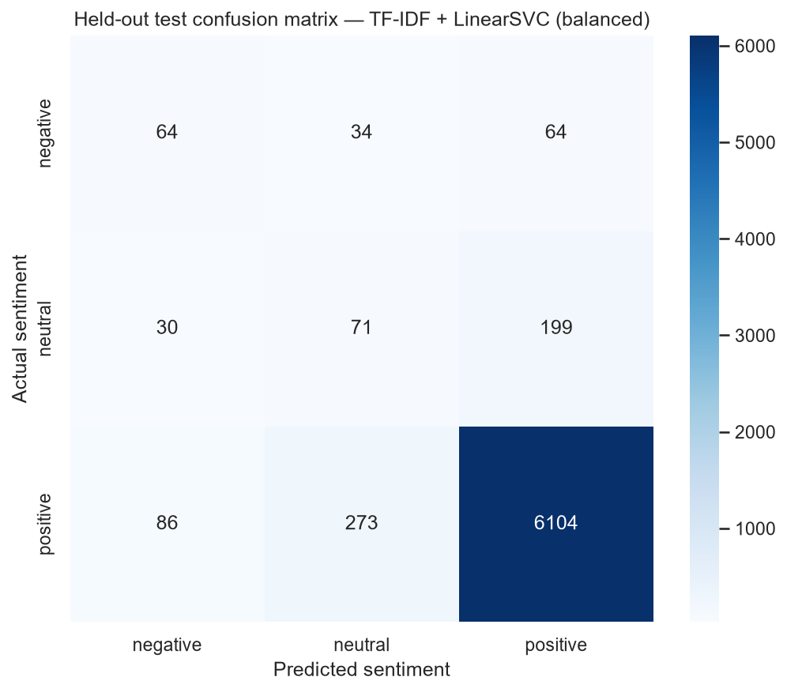
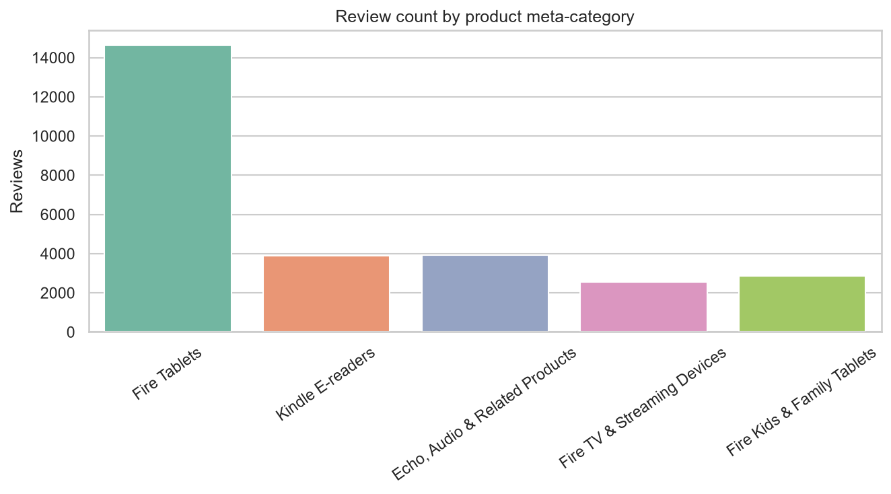

# NLP Automated Customer Reviews

**Presented by Ayse A. Oed and Ivan Metteuzi**

An NLP pipeline that turns thousands of Amazon product reviews into insights: it classifies sentiment, clusters products into categories, generates category summaries with a local generative model, and shares everything through a public Streamlit app that also translates reviews into German.

**Live app:** https://project-brief-nlp-automated-customers-reviews-4z3nd6dqfyj7ba8x.streamlit.app/

## Presentation

- [View the presentation on Prezi](https://prezi.com/craft/room/oyHsJyeBu8tj7NJLmwHTHq?referral_token=XlRy38lnB3FN)
- [Download the presentation slides (PDF)](presentation/NLP_Customer_Reviews_Slides.pdf)

## Project Overview

**Problem statement.** With thousands of reviews available across multiple platforms, manually analyzing them is inefficient. This project automates the process with NLP models that extract insights from customer feedback and give users product recommendations.

| Question the business asks | Task | Output |
|---|---|---|
| How do customers feel about each product? | 1. Sentiment classification | Positive / neutral / negative model |
| Which products belong together? | 2. Product clustering | 5 meta-categories |
| What should a buyer know about each category? | 3. Generative summaries | Recommendation articles |
| How can teams explore and share this? | 4. Streamlit dashboard and predictor | Public app |
| Can non-English readers use the insights? | 5. English to German translation | Translate tab and evaluation |

## Dataset

- **Source:** Amazon consumer product reviews (`1429_1.csv`, the Datafiniti "Consumer Reviews of Amazon Products" data provided with the project brief). Place it at `datasets/1429_1.csv`.
- **Size:** about 49 MB; 34,625 reviews are used for modelling.
- **Features used:** product name, category metadata, review text, star rating.
- **Preprocessing:** missing values dropped, product names normalized, review text lowercased and stripped of punctuation for the classical models, labels derived from stars (1-2 negative, 3 neutral, 4-5 positive). Duplicate review records are removed when selecting evidence for the Task 3 summaries.
- The dataset is **not committed** (it is large and review text is not republished). The public app uses only an aggregate JSON file without review text.

## Method / Model

1. **Sentiment (Task 1).** Five TF-IDF / bag-of-words classifiers compared on a stratified 60/20/20 train/validation/test split, selected by validation macro F1 (the data is heavily imbalanced). The winner, TF-IDF + class-balanced LinearSVC, was refit on train + validation and tested once.
2. **Clustering (Task 2).** Product-level K-Means on TF-IDF features of product names, catalog categories and sampled review text. 4, 5 and 6 clusters were compared; 5 was kept for interpretability.
3. **Summaries (Task 3).** For each cluster the code picks the top-rated and lowest-rated products and negative excerpts, then Hugging Face `sshleifer/distilbart-cnn-12-6` summarizes them locally (no API key). An optional OpenAI route (`gpt-4o-mini`, key via `OPENAI_API_KEY`) exists but its live comparison was not run.
4. **Dashboard (Task 4).** Streamlit app with an insights dashboard and a single-review predictor using the saved Task 1 model.
5. **Translation (Task 5).** `Helsinki-NLP/opus-mt-en-de` (MarianMT). Informal text and abbreviations are normalized first, product names are kept exactly as written, German reviews pass through unchanged and other languages are flagged as unsupported.

## Results

**Task 1 - sentiment (untouched test set, 6,925 reviews):** accuracy 90.09%, macro F1 51.17%, weighted F1 90.59%.

| Sentiment | Precision | Recall | F1 | Support |
|---|---:|---:|---:|---:|
| Negative | 35.56% | 39.51% | 37.43% | 162 |
| Neutral | 18.78% | 23.67% | 20.94% | 300 |
| Positive | 95.87% | 94.45% | 95.15% | 6,463 |



Accuracy is high mainly because about 92% of reviews are positive; many negative and neutral reviews are predicted as positive.

**Task 2 - clustering:** 40 named products grouped into **Fire Tablets**, **Kindle E-readers**, **Echo, Audio & Related Products**, **Fire TV & Streaming Devices** and **Fire Kids & Family Tablets**. Cosine silhouette for 4/5/6 clusters is about 0.105 / 0.111 / 0.130, so the groups overlap and the result is exploratory. Six clusters scored slightly higher but only split off a 39-review legacy group.



**Task 3 - summaries:** one DistilBART article per category in `outputs/task3_local_category_articles.md`. Abstractive summaries can distort details, so they are drafts to verify against the reviews. The `task3_ai_drafts.csv` / `task3_category_articles.md` files are legacy API drafts and are not verified as live API results.

**Task 5 - translation (30 sampled reviews, 10 per sentiment):** there are no human German references, so BLEU and ROUGE are round-trip (English to German to English) proxies: BLEU about 55, ROUGE-1 about 0.83. The Task 1 sentiment prediction was preserved for 80% of reviews (positive 100%, negative and neutral 70%).
- Worked well: plain, well-spelled reviews, e.g. "Great tablet, works w/o wifi, love it!" becomes "Ein tolles Tablet, funktioniert ohne WLAN, liebe es!".
- Meaning errors found and fixed with pre/post-edits: "tablet" translated as the German word for pill, sentence-initial "Great" read as the name "Große", and wrong gender for "Tablet".
- Still weak: misspelled input is translated too literally ("as i though" became "as me"), and mild negatives can drift toward neutral.

## Demo / Deployment

Open the [live app](https://project-brief-nlp-automated-customers-reviews-4z3nd6dqfyj7ba8x.streamlit.app/). It has three tabs:
- **Review insights dashboard:** filter by category; compare sentiment by category, review length and product; see keyword-based complaint themes; download the table as CSV; read the category guides. Review dates are not in the data, so there is no trend chart.
- **Single-review predictor:** paste a review and get its predicted sentiment (scores are softmax of SVM decision values, not calibrated probabilities).
- **Translate to German:** paste an English review. The first translation after the app wakes up downloads the roughly 300 MB model, so it can take a while.

It deploys from branch `main` with `deploy/streamlit_app.py` as the entry point and installs `deploy/requirements.txt`. It needs `models/task1_recommended_model.joblib` and `outputs/dashboard_insights.json`, not the source CSV or any secrets. Submitted text is not intentionally stored.

## How to Run the Project

```bash
pip install -r requirements.txt          # full project dependencies
python run_project.py                    # Tasks 1-3 (needs datasets/1429_1.csv)
python -m src.build_dashboard_artifacts  # builds outputs/dashboard_insights.json
python src/evaluate_translation.py       # Task 5 evaluation (writes outputs/task5_*)
streamlit run deploy/streamlit_app.py    # start the app
```

Optional hosted Task 3 generation reads the `OPENAI_API_KEY` environment variable (and optionally `OPENAI_MODEL`); it may incur charges and sends review excerpts to OpenAI. Never commit keys or `.streamlit/secrets.toml`. The step-by-step walkthroughs are in `notebooks/Task 1-4.ipynb`; the local Task 3 run downloads about 1.2 GB of model weights.

## Project Structure

```text
.
├── deploy/
│   ├── streamlit_app.py            # public app (dashboard, predictor, translation)
│   ├── requirements.txt            # pinned deployment dependencies
│   ├── hf_backend/, publish_hf_space.py   # optional prediction API for Hugging Face Spaces
├── app/app.py                      # earlier local Gradio demo
├── models/task1_recommended_model.joblib
├── notebooks/                      # Task 1-4 walkthroughs
├── outputs/                        # metrics, charts, summaries, dashboard_insights.json, task5 metrics
├── src/
│   ├── pipeline.py                 # loading, cleaning, Task 1 and 2 code
│   ├── task3_local_summarizer.py   # local DistilBART summaries
│   ├── task3_summarizer.py         # optional OpenAI summaries
│   ├── build_dashboard_artifacts.py
│   ├── translation.py              # English to German translation
│   ├── evaluate_translation.py
│   └── project_config.py
├── tests/
├── run_project.py
└── requirements.txt
```

## Key Findings and Limitations

- Positive reviews are easy to detect (F1 95%); negative (37%) and neutral (21%) are weak because of class imbalance, so accuracy alone is misleading.
- Star ratings are noisy sentiment labels.
- Clusters overlap (silhouette about 0.11); they are a useful grouping, not sharp categories.
- Complaint themes are keyword matches, not a trained topic model, and one review can match several themes.
- Summaries are not automatically checked against the source reviews.
- Translation was checked on only 30 reviews with proxy metrics, not human references; it can change the meaning of informal or misspelled reviews.
- The cleaned review text has no punctuation or casing, so translation uses the raw dataset instead.
- Hosting the translation model inside a small Streamlit Cloud container may be slow or hit memory limits.

**Next steps:** fine-tune a transformer and calibrate its scores; replace keyword themes with topic modelling checked on a small hand-labelled set; have a native German speaker rate about 100 translations; add tests and CI and serve translation from its own API.

## Credits and References

- Dataset: Datafiniti, "Consumer Reviews of Amazon Products" (Kaggle), provided with the project brief.
- Models: [`sshleifer/distilbart-cnn-12-6`](https://huggingface.co/sshleifer/distilbart-cnn-12-6), [`Helsinki-NLP/opus-mt-en-de`](https://huggingface.co/Helsinki-NLP/opus-mt-en-de) and [`opus-mt-de-en`](https://huggingface.co/Helsinki-NLP/opus-mt-de-en) (back-translation).
- Libraries: scikit-learn, pandas, Hugging Face Transformers, PyTorch, Streamlit, langdetect, sacreBLEU, rouge-score.
- Optional: OpenAI Chat Completions API.
